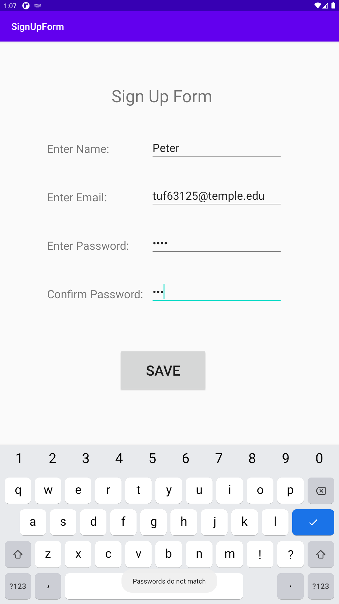

# Assignment 2 

# Blank Sign Up Form with Texts, Inputs, and a Button
SignUpForm contains a Title TextView at the top and separate TextView's for Name, Email, Password, and Confirm Password to the left of the layout.
Also contains Input fields for Name, Email, Password, and Confirm Password to the right of the layout.
Includes a Save button for sign up.
This image shows a blank application.

# Empty Field Toast
When a user leaves any of the input fields blank and clicks Save, a toast message at the bottom will display "Must enter all information"

# Unmatched Password Toast
When a user has unmatched passwords and clicks Save, a toast message at the bottom will display "Passwords do not match"

# Filled Form
This image shows a filled form with matching passwords before clicking Save.

# Success Dialog
When a user has information in all fields and their passwords match, clicking the Save button will display a Dialog Box with title "SUCCESS!" and a message for the user.

NOTE: When a user clicks away from the dialog box, it will exit and run the application over again.
